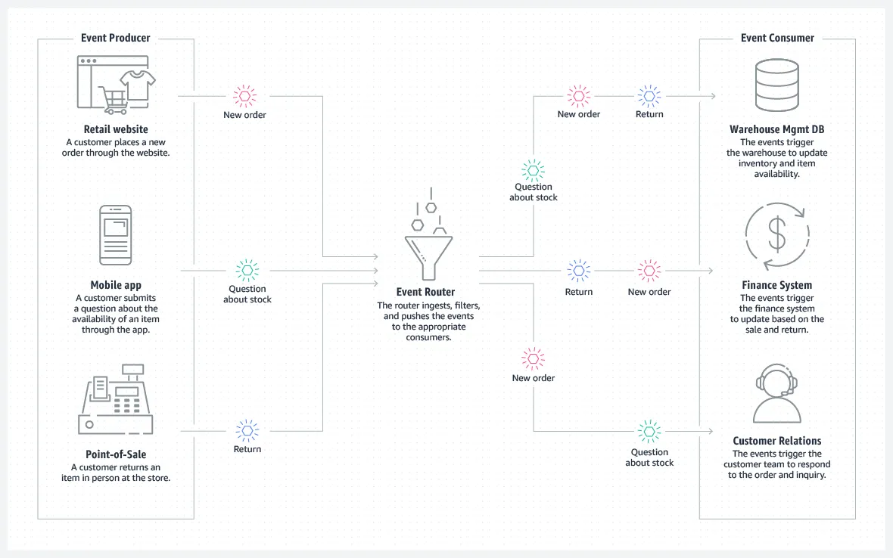

# Club Service

Сервис групп для юзеров, настройки анкет групп для админов групп и обработка этих анкет для вступления в группу юзеров

---

## Функциональные требования

- Хранение информации о группе: участники, настройки анкеты, изменение админов
- Обработка анкет юзеров
- Создание новой группы
- Получение списка групп юзера

---

## Проблемы и их решения

Проблема: Matcher service должен знать о том в каких группах находятся юзеры - чтобы матчить их только внутри групп

Решение: отправлять события добавления/уход юзера из группы в топик брокера

[The Complete Guide to Event-Driven Architecture](https://medium.com/@seetharamugn/the-complete-guide-to-event-driven-architecture-b25226594227)

## Доменная модель

